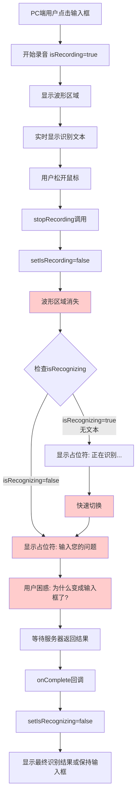
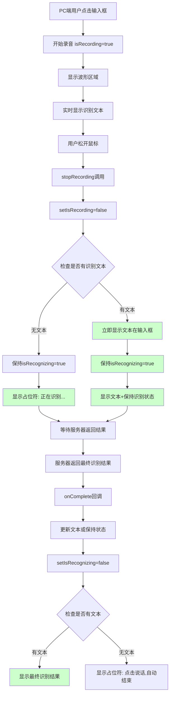
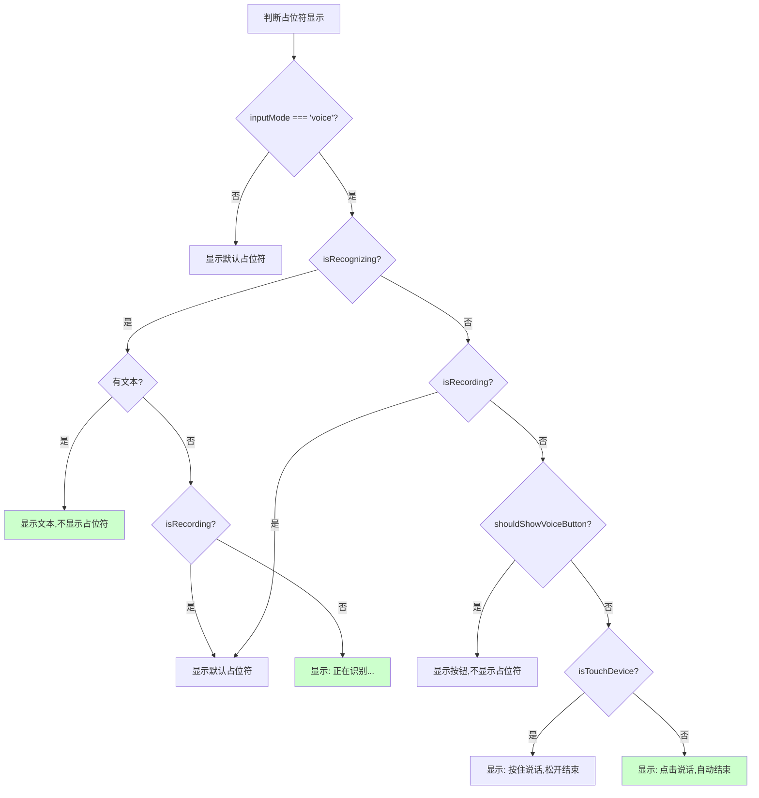
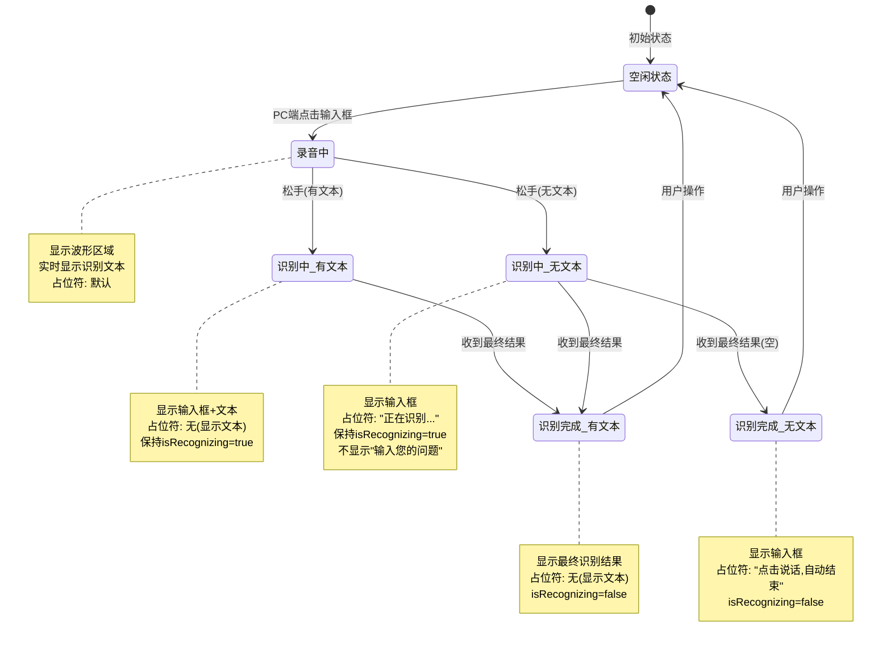
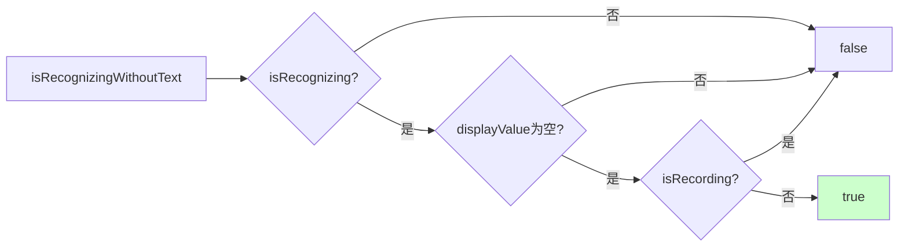
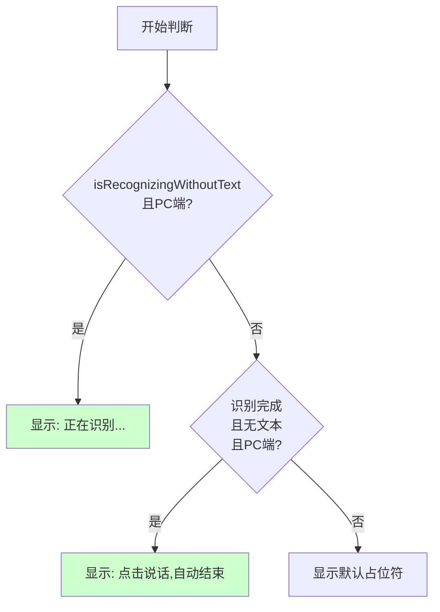

# PC端语音识别显示状态优化流程图

**重要说明**：本文档仅针对PC端优化，手机端逻辑保持不变，无问题。

## 当前流程（存在问题 - 仅PC端）



**问题点：**
- ❌ 松手后波形区域立即消失
- ❌ 占位符从"正在识别..."快速切换到"输入您的问题"
- ❌ 状态切换不清晰，用户感到困惑
- ❌ 识别中不应该显示"输入您的问题"，因为用户并没有输入

## 优化后的流程（仅PC端）



**改善点：**
- ✅ 松手后立即检查是否有识别文本
- ✅ 有文本时立即显示，无等待感
- ✅ 无文本时保持"正在识别..."状态，不切换
- ✅ 识别完成前不会显示"输入您的问题"
- ✅ 状态清晰，用户体验流畅

## 占位符显示逻辑流程图



## 状态转换图



## 关键状态判断逻辑

### 1. isRecognizingWithoutText 判断



### 2. 占位符优先级判断



## 优化前后对比

### 当前体验（有问题）

| 时间点 | 状态 | 显示内容 | 用户感受 |
|--------|------|----------|----------|
| 点击输入框 | 录音中 | 波形区域 + 实时文本 | ✅ 正常 |
| 松开鼠标 | 识别中 | 输入框 + "正在识别..." | ✅ 正常 |
| 0.5秒后 | 识别中 | 输入框 + "输入您的问题" | ❌ 困惑：为什么变了？ |
| 1-2秒后 | 识别完成 | 输入框 + 识别结果 | ✅ 正常 |

### 优化后体验

| 时间点 | 状态 | 显示内容 | 用户感受 |
|--------|------|----------|----------|
| 点击输入框 | 录音中 | 波形区域 + 实时文本 | ✅ 正常 |
| 松开鼠标(有文本) | 识别中 | 输入框 + 识别文本 | ✅ 立即看到结果 |
| 松开鼠标(无文本) | 识别中 | 输入框 + "正在识别..." | ✅ 明确知道在识别 |
| 识别完成 | 识别完成 | 输入框 + 最终结果 | ✅ 正常 |

## 实施要点（仅PC端）

### 1. 占位符逻辑优化（明确区分PC端和移动端）

```typescript
// ✅ 优化后的逻辑（仅PC端）
const isRecognizingWithoutText = isRecognizing && !displayValue && !isRecording;

const displayPlaceholder = 
  // ⚠️ PC端识别中且无文本：始终显示"正在识别..."（关键修复）
  (inputMode === 'voice' && !isTouchDevice() && isRecognizingWithoutText)
    ? '正在识别...'
    // PC端识别完成且无文本：显示"点击说话,自动结束"
    : (inputMode === 'voice' && !isTouchDevice() && !isRecording && !isRecognizing && !shouldShowVoiceButton)
      ? '点击说话，自动结束'
      // ✅ 移动端逻辑（保持不变，无问题）
      : (inputMode === 'voice' && isTouchDevice() && !isRecording && !isRecognizing && !shouldShowVoiceButton)
        ? '按住说话，松开结束'
        // 默认占位符
        : (placeholder || t('ui.inputPlaceholder'));
```

**关键点**：
- 使用 `!isTouchDevice()` 明确标识PC端
- PC端识别中时，优先判断 `isRecognizingWithoutText`，确保显示"正在识别..."
- 移动端逻辑完全保持不变

### 2. 状态保持

- 确保 `isRecognizing` 在识别过程中保持 `true`
- 只有在 `onComplete` 回调中才设置为 `false`
- 避免在 `stopRecording` 中过早设置为 `false`

### 3. 视觉反馈（可选）

- 识别中时，输入框边框可以显示蓝色
- 可以添加微妙的加载动画
- 使用颜色变化表示状态

## 关键改进点总结（仅PC端）

1. **状态连续性**：PC端识别中始终保持"正在识别..."，不切换
2. **明确反馈**：PC端有文本立即显示，无文本明确提示
3. **避免混淆**：PC端识别中不显示"输入您的问题"
4. **用户体验**：PC端流畅的状态转换，无视觉跳跃
5. **移动端**：✅ 保持原有逻辑不变，无问题

## 注意事项

⚠️ **重要**：
- 只修改PC端的占位符显示逻辑
- 使用 `!isTouchDevice()` 明确区分PC端
- 移动端使用 `isTouchDevice()` 保持原有逻辑
- 确保修改不影响手机端的正常功能

