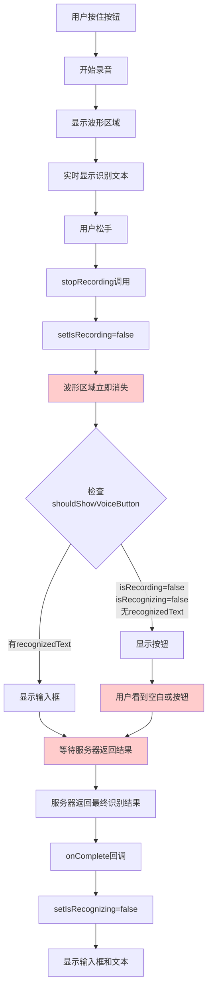
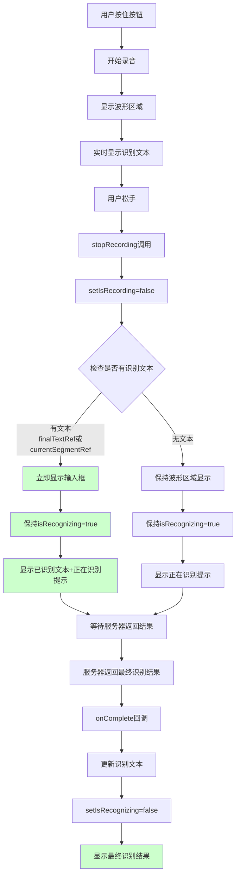
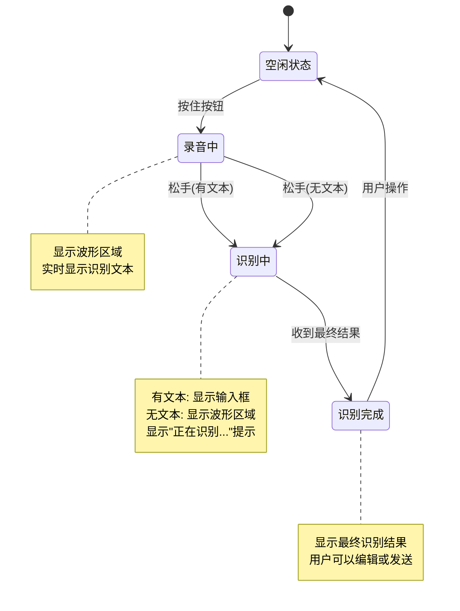

# 手机端语音识别流程优化方案

## 当前流程（存在问题）



**问题点：**
- ❌ 松手后波形区域立即消失，用户看到空白
- ❌ 需要等待服务器返回结果才显示输入框
- ❌ 用户体验不流畅，有等待感

## 改善后的流程



**改善点：**
- ✅ 松手后立即检查是否有识别文本
- ✅ 有文本时立即显示输入框，无等待感
- ✅ 保持 isRecognizing 状态，显示"正在识别..."提示
- ✅ 平滑过渡，用户体验流畅

## 关键代码修改点

### 1. stopRecording 函数优化

```typescript
const stopRecording = useCallback(() => {
  // ... 现有代码 ...
  
  setIsRecording(false);
  isRecordingRef.current = false;
  
  // ✅ 新增：检查是否有识别文本
  const hasRecognizedText = finalTextRef.current || currentSegmentRef.current;
  
  if (hasRecognizedText) {
    // 有文本：立即显示输入框
    // 保持 isRecognizing = true，等待最终结果
    // 通过 shouldShowVoiceButton 逻辑自动切换
  } else {
    // 无文本：保持波形区域显示
    // 保持 isRecognizing = true，等待识别结果
  }
  
  // ... 其余代码保持不变 ...
}, [cleanupAudioResources, onChange]);
```

### 2. shouldShowVoiceButton 逻辑优化

```typescript
// ✅ 改善后的逻辑
const shouldShowVoiceButton = inputMode === 'voice' && isTouchDevice() && 
  (isRecording || (isRecognizing && !finalTextRef.current && !currentSegmentRef.current && !recognizedText));
  
// 解释：
// - 正在录音时：显示按钮
// - 识别中但无任何文本时：显示按钮
// - 识别中且有文本时：显示输入框（立即反馈）
// - 识别完成：显示输入框
```

### 3. 输入框显示逻辑优化

```typescript
// ✅ 改善后的显示逻辑
const getDisplayValue = () => {
  if (recognizedText !== null) {
    return recognizedText;
  }
  
  const fullText = finalTextRef.current + currentSegmentRef.current;
  
  // ✅ 新增：如果正在识别但无文本，显示提示
  if (isRecognizing && !fullText) {
    return ''; // 显示占位符"正在识别..."
  }
  
  return fullText || value;
};

// ✅ 占位符逻辑
const displayPlaceholder = inputMode === 'voice' && isRecognizing && !displayValue
  ? '正在识别...'
  : (inputMode === 'voice' && !isRecording && !isRecognizing && !shouldShowVoiceButton
    ? (isTouchDevice() ? '按住说话，松开结束' : '点击说话，自动结束')
    : (placeholder || t('ui.inputPlaceholder')));
```

### 4. 波形区域显示逻辑优化

```typescript
// ✅ 改善后的显示逻辑
{isRecording || (isRecognizing && !finalTextRef.current && !currentSegmentRef.current) ? (
  <div style={getStyles().waveformArea}>
    {/* 波形显示 */}
  </div>
) : null}

// 解释：
// - 正在录音：显示波形
// - 识别中但无文本：显示波形（保持视觉反馈）
// - 识别中且有文本：隐藏波形（立即切换到输入框）
```

## 状态转换图



## 用户体验对比

### 当前体验
1. 用户松手 → 空白（0.5-2秒）→ 输入框出现 → 文本显示
2. 用户感受：❌ "是不是卡住了？"

### 改善后体验
1. 用户松手 → 立即显示输入框和文本 → "正在识别..."提示 → 文本更新
2. 用户感受：✅ "系统在正常工作，我知道它在处理"

## 实施优先级

1. **高优先级**：优化 `shouldShowVoiceButton` 逻辑（立即改善体验）
2. **高优先级**：优化 `stopRecording` 函数（核心逻辑）
3. **中优先级**：添加"正在识别..."提示（增强反馈）
4. **中优先级**：优化波形区域显示逻辑（视觉优化）
5. **低优先级**：添加过渡动画（锦上添花）

